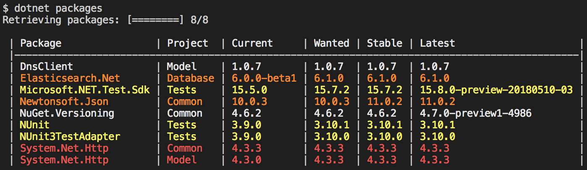

# dotnet packages

## About

This tool finds all packages referenced in all csproj and fsproj files in the current directory and all its subdirectories (recursively), and then connects to NuGet to find which packages have updates available. Only .NET Core project files are supported.

This tool plugs into the dotnet CLI toolchain by putting the executable (`dotnet-packages`) in the path, then running `dotnet packages`.

Example:

Package = name of the NuGet package  
Project = name of the csproj or fsproj file  
Current = currently installed version of the package  
Wanted = latest package with the same major version  
Stable = latest stable version  
Latest = latest available version  

Red = different versions of the same package are used within the scope that the tool was run  
Orange = either a later major version of the package is available, or a stable version is available where a prerelease is used  
Yellow = a later minor version is available  
White = no later stable version is available  

Based on https://github.com/goenning/dotnet-outdated

## Setting up

1. Build an executable: `dotnet publish -c Release -r [RID]` (use the RID for your system, such as `win-x64` or `osx-x64`)
1. Copy the resulting binaries (in `bin/Release/netcoreapp2.0/[RID]/`) to somewhere in the path
1. Run `dotnet packages` in any directory containing .NET Core projects
